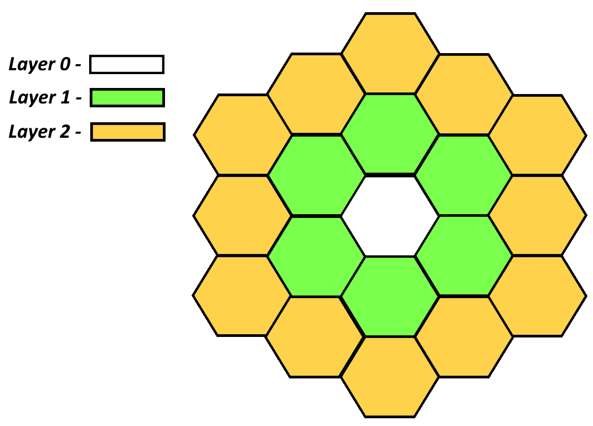
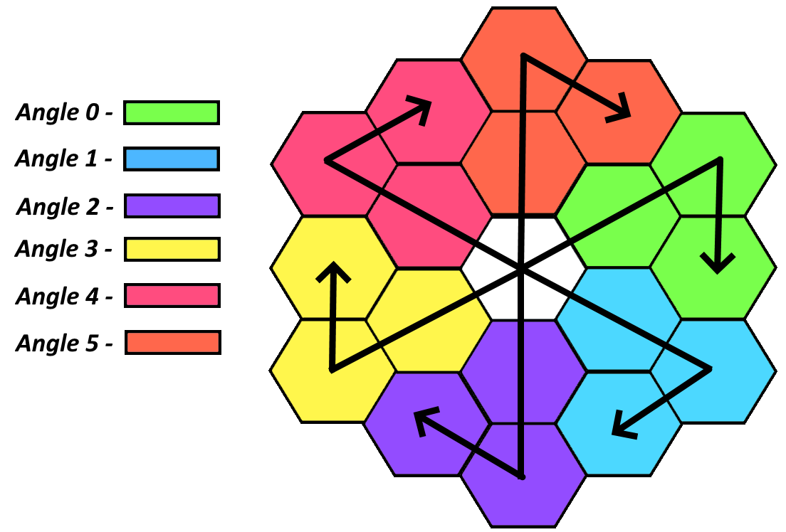
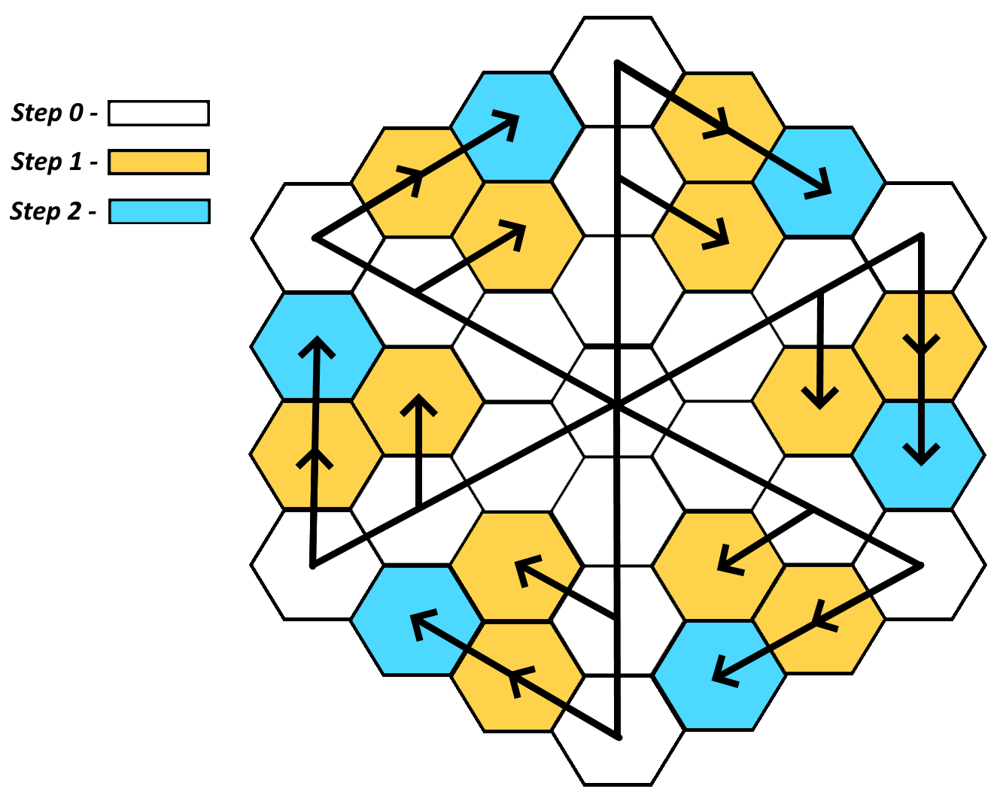

# Hex grid LAS system

<h1 align="center">  Hexagonal Grid </h1>
<h3 align="center"> Python scripts for interactive hex regular map </h3>

<p align="center"> 
  
</p>

## Overview

<p align="justify"> 
  In this project, a system for organizing a grid of hexagons is presented. This system is referential - (each grid cell contains links to its neighbors), which makes it easy to implement search algorithms cells according to any rules.

 The work of the system can be divided into two stages - the creation of a grid, work with it. At the stage of creating a grid, all of its elements and relationships between them. To set the grid, a system of three coordinates layer, angle, step is used. The LAS system allows you to uniquely set the coordinate of each cell. To pass through all elements of the grid, use grid_range generator function, linking_cells function to set neighbors (see <a href="https://github.com/DmitriyKhudiakov/Hex-grid-LAS-system/blob/main/Grid.py">Grid.py</a>). Further work with the grid
is based on neighbors, which greatly simplifies the creation of algorithms for finding paths relative to the selected cell (shown above).
</p>

<p align="center"> 
     
</p>


## Installation
Clone this repo
```bash
git clone https://github.com/DmitriyKhudiakov/Hex-grid-LAS-system.git
```
Install libs
```bash
pip install -r requirements.txt
```

## Usage
Run visualization
```bash
main.py
```


## License
[MIT](https://choosealicense.com/licenses/mit/)
